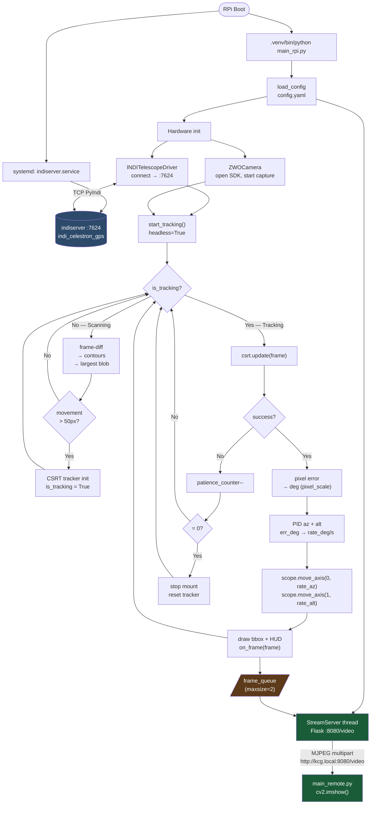
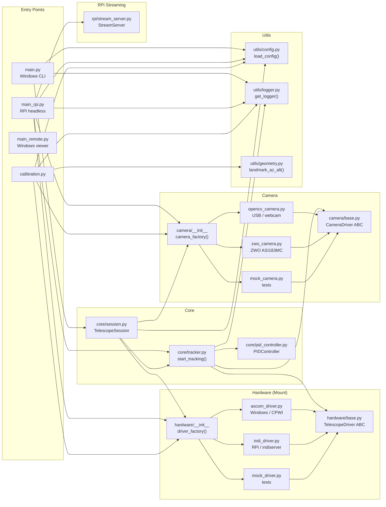

# TelescopeAI — Project Architecture Map

> **תרשימים אינטראקטיביים:** פתח קובץ זה ב-GitHub — התרשימים מתרנדרים אוטומטית.
> לצפייה מיידית: העתק כל בלוק `mermaid` ל-[mermaid.live](https://mermaid.live)

---

## Diagram 1 — Runtime Process Flow

מה קורה בזמן ריצה: מ-boot ועד פקודת ציר.



---

## Diagram 2 — Module Dependency Map

קשרים בין מודולים: מי מייבא את מי, ואיפה עוברת השליטה.



---

## System Overview

```
┌──────────────────────────────────────────────────────────────────┐
│                        ENTRY POINTS                              │
│   main.py          — Windows interactive CLI (ASCOM + OpenCV)   │
│   main_rpi.py      — RPi headless (INDI + ZWO + MJPEG stream)  │
│   main_remote.py   — Windows viewer (receives RPi stream)       │
│   calibration.py   — Pixel scale + mount alignment wizard       │
└──────────────────────────────────────────────────────────────────┘
                              ↓
┌──────────────────────────────────────────────────────────────────┐
│                  CORE ORCHESTRATION                              │
│   core/session.py  — TelescopeSession (context manager)         │
│     owns: scope + camera, slew_to(), start_tracking()           │
└──────────────────────────────────────────────────────────────────┘
                              ↓
┌──────────────────────────────────────────────────────────────────┐
│                  TRACKING PIPELINE                               │
│   core/tracker.py  — start_tracking(scope, cam, cfg, ...)       │
│     Scanning mode: frame-diff → contours → CSRT init            │
│     Tracking mode: CSRT update → pixel error → PID → mount      │
│                              ↓                                   │
│   core/pid_controller.py — PIDController                        │
│     input: error (deg)  output: rate (deg/s), per axis          │
└──────────────────────────────────────────────────────────────────┘
          ↓ scope.move_axis()              ↓ camera.read()
┌─────────────────────┐        ┌──────────────────────────┐
│  HARDWARE / MOUNT   │        │       CAMERA             │
│  base.py (ABC)      │        │  base.py (ABC)           │
│  ├ ascom_driver.py  │        │  ├ opencv_camera.py      │
│  ├ indi_driver.py   │        │  ├ zwo_camera.py         │
│  └ mock_driver.py   │        │  └ mock_camera.py        │
│  __init__.py        │        │  __init__.py             │
│  driver_factory(cfg)│        │  camera_factory(cfg)     │
└─────────────────────┘        └──────────────────────────┘
```

---

## Module-by-Module Reference

### Entry Points

| File | Mode | Key function |
|------|------|-------------|
| [main.py](main.py) | Windows (ASCOM + OpenCV) | `run_telescope_control()` — menu: track, gps, north, moon, mars... |
| [main_rpi.py](main_rpi.py) | RPi headless | `main()` — tracker + MJPEG stream in threads |
| [main_remote.py](main_remote.py) | Windows viewer | `main()` — reads `http://kcg.local:8080/video`, shows cv2.imshow |
| [calibration.py](calibration.py) | Any | `main()` — pixel_scale, roll, alignment wizard |

### Core

| File | Class / Function | Purpose |
|------|-----------------|---------|
| [core/session.py](core/session.py) | `TelescopeSession` | Context manager owning scope + camera. `slew_to(name, az, alt)` with altitude safety. Wraps `start_tracking()`. |
| [core/tracker.py](core/tracker.py) | `start_tracking(scope, cam, cfg, on_frame, headless, stop_event)` | Full tracking loop. Scanning via frame-diff → locks with CSRT → feeds PID → calls `scope.move_axis()`. `on_frame` callback enables headless streaming. |
| [core/pid_controller.py](core/pid_controller.py) | `PIDController` | Standard PID with anti-windup and output limits. `.update(error_deg)` → rate_deg_s. Separate instance per axis. |

### Hardware Drivers (Mount)

| File | Class | Backend |
|------|-------|---------|
| [hardware/base.py](hardware/base.py) | `TelescopeDriver` (ABC) | Defines interface: `connect`, `disconnect`, `slew_to_altaz_async`, `move_axis`, `abort_slew`, `sync_to_altaz` |
| [hardware/ascom_driver.py](hardware/ascom_driver.py) | `ASCOMTelescopeDriver` | Windows COM via `win32com`. Used with CPWI / NexStar. |
| [hardware/indi_driver.py](hardware/indi_driver.py) | `INDITelescopeDriver` | PyIndi TCP to `indiserver` on RPi. Properties polled, not event-driven. |
| [hardware/mock_driver.py](hardware/mock_driver.py) | `MockTelescopeDriver` | In-memory, records all calls. For tests. |
| [hardware/\_\_init\_\_.py](hardware/__init__.py) | `driver_factory(cfg)` | Selects by `mount.backend`: `"ascom"` / `"indi"` / `"mock"` |

### Camera Drivers

| File | Class | Backend |
|------|-------|---------|
| [camera/base.py](camera/base.py) | `CameraDriver` (ABC) | Interface: `open`, `release`, `read()` → `(bool, BGR frame)`, `width`, `height` |
| [camera/opencv_camera.py](camera/opencv_camera.py) | `OpenCVCamera` | `cv2.VideoCapture` (DSHOW on Win, V4L2 on Linux) |
| [camera/zwo_camera.py](camera/zwo_camera.py) | `ZWOCamera` | `zwoasi` package. Outputs RGB24 → converted to BGR. |
| [camera/mock_camera.py](camera/mock_camera.py) | `MockCamera` | Generates frames with a synthetic moving dot (Lissajous). For PID tests. |
| [camera/\_\_init\_\_.py](camera/__init__.py) | `camera_factory(cfg)` | Selects by `camera.backend`: `"opencv"` / `"zwo"` / `"mock"` |

### RPi Streaming

| File | Class | Purpose |
|------|-------|---------|
| [rpi/stream_server.py](rpi/stream_server.py) | `StreamServer` | Flask MJPEG server. Reads `frame_queue`, encodes JPEG, serves on `/video`. |

### Utilities

| File | Functions | Purpose |
|------|-----------|---------|
| [utils/config.py](utils/config.py) | `load_config(path)`, `save_config(cfg, path)` | Read/write `config.yaml`. |
| [utils/logger.py](utils/logger.py) | `setup_logging(cfg)`, `get_logger(name)` | Unified logging (console + file). |
| [utils/geometry.py](utils/geometry.py) | `landmark_az_alt()`, `haversine()`, `true_bearing()`, `apply_refraction()` | GPS coordinates → Az/Alt for alignment. |

---

## Data Flow: Camera Frame → Mount Command

```
camera.read()
    │
    ▼ BGR numpy array (H × W × 3, uint8)
    │
    ├─ [SCANNING MODE — is_tracking=False]
    │   gray → Gaussian blur → absdiff with prev frame
    │   → threshold → dilate → find contours (area > 500px²)
    │   → track potential_target position
    │   → if movement > 50px: init CSRT, is_tracking=True
    │
    └─ [TRACKING MODE — is_tracking=True]
        csrt_tracker.update(frame) → (success, bbox)
        │
        obj_x, obj_y = bbox center
        err_x_deg = (obj_x - frame_cx) * pixel_scale   ← Az error
        err_y_deg = (frame_cy - obj_y) * pixel_scale   ← Alt error (flipped)
        │
        rate_az  = pid_az.update(err_x_deg)
        rate_alt = pid_alt.update(err_y_deg)
        │
        scope.move_axis(0, rate_az)    ← Azimuth
        scope.move_axis(1, rate_alt)   ← Altitude
        │
        on_frame(annotated_frame)      ← optional (RPi streaming)
```

---

## Axis & Rate Convention

```
axis 0 = Azimuth       rate > 0 → East,  rate < 0 → West
axis 1 = Altitude      rate > 0 → North, rate < 0 → South
units: degrees/second
```

---

## Config Structure (config.yaml)

```yaml
location:     lat/lon/alt — observer position (Skyfield + geometry)
landmarks:    GPS points for daytime alignment
tracking:     pixel_scale, pid_kp/ki/kd, movement_threshold_px
camera:       backend, index/sdk_path, width, height, exposure
mount:        backend, driver name, move/calibration rates
indi:         host, port, device_name (RPi only)
stream:       port, quality (RPi only)
rpi:          host (Windows viewer only)
logging:      level, file, file_level
calibration:  auto-written by calibration.py
```

---

## Deployment Modes

| Mode | Config | Run command |
|------|--------|-------------|
| Windows (full) | `mount.backend: ascom`, `camera.backend: opencv` | `python main.py` |
| RPi (headless) | `mount.backend: indi`, `camera.backend: zwo` | `.venv/bin/python main_rpi.py` |
| Windows viewer | — | `python main_remote.py` |
| Tests | `mount.backend: mock`, `camera.backend: mock` | `pytest tests/` |
